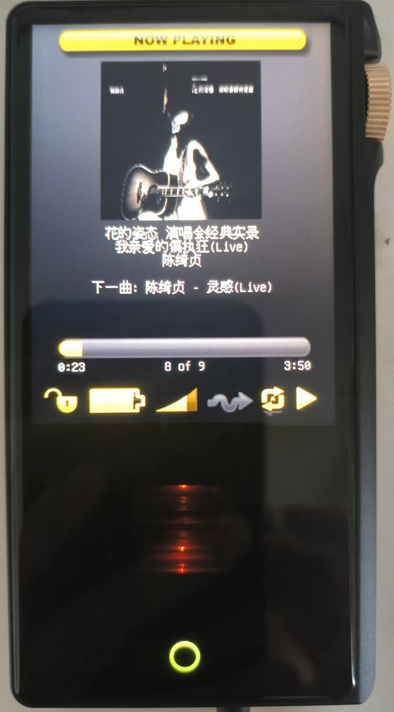

# Rockbox for the Cayin N3Pro

A **hosted** Rockbox port for the Cayin N3Pro digital audio player
(Ingenic X1000 "MIPS XBurst", Linux 3.10, HiByOS).

Rockbox runs as a normal Linux application on top of the stock HiByOS.  The
boot loader, the kernel and the stock player binary are left untouched, so the
installation is **fully reversible and cannot brick the device**.

  

Download the ready-made image and SD-card payload from the
[latest release](https://github.com/ctzjj/Rockbox-N3PRO/releases/latest).

## Status

| Feature | State |
|---|---|
| Boot (Rockbox boot menu + fallback to the stock player) | working |
| LCD (360x480, 32bpp XRGB8888, 180° rotated, tear-free beam-chased updates) | working |
| Buttons (power / prev / play / next) | working |
| Touchscreen (GT9xx) + bottom-front HOME key | working |
| Volume wheel (rotary encoder -> scroll wheel) | working |
| Audio (dual AK4493 via ALSA) | working |
| Headphone / line / balanced detection | working |
| DAC filter roll-off (5 modes) + Tube Mode for the 2x JAN6418 tubes (transistor/triode/ultra-linear) | working |
| SD card (`/mnt/sd_0`) | working |
| USB: Mass Storage / Charge only / ADB modes | working |
| USB Audio (USB DAC, incl. "DAC + storage" and "DAC + ADB" gadgets) | working* |
| Bluetooth output (A2DP earphones: scan / pair / connect, LDAC/APTX/AAC/SBC) | working |
| Bluetooth input (phone A2DP → Rockbox DSP → wired outputs) | working |
| RGB status LED (charge + playback, colour by sample rate) | working |
| Battery gauge | working (kernel fuel gauge) |
| Backlight / sleep | working |
| Plugins (full set: Main Menu Config, lrcplayer, games, puzzles, ...) | working |

\* verified on Windows; in the ADB composite the adb interface uses the
in-box WinUSB driver, so the **libusb** adb backend is required
(`set ADB_LIBUSB=1`, or use Linux/macOS).

## Hardware notes

* SoC: Ingenic X1000, Linux 3.10.14, HiByOS.
* Display: 360x480 smart LCD (SLCD); the kernel framebuffer is **32bpp
  XRGB8888** with a 1440-byte stride, and the panel is mounted rotated 180°.
  Rockbox keeps its internal 16bpp RGB565 framebuffer and converts/rotates on
  update, staying ahead of the panel's scan beam for tear-free rendering
  (`firmware/target/hosted/cayin/n3pro/lcd-n3pro.c`).
* Audio: dual AK4493 DACs on ALSA card 0 (`n3pro-ak4493-i2s`).  Digital filters
  are the ALSA `AK4493 Digital Filter` (5 modes) and `Digital Filter` controls.
  The output stage also has **two JAN6418 subminiature tubes**; *Tube Mode*
  selects how they run: transistor (tubes powered off), **triode** or
  **ultra-linear** (the two wiring/tap configurations of the same tubes).  It is
  a two-step operation: power the tubes via the sysfs `timbre_select`, then
   select the wiring through the `Timbre Tube Mode` ALSA control.  The tubes are
   powered only while playing **from the 3.5 mm headphone jack** and switched off
   10 s after pause; the line-out and 4.4 mm balanced outputs always use the
   transistor stage (as in the stock firmware).  Insert detection works on all
   three jacks (headphone / line-out / balanced) and routes the DAC accordingly.
* Volume: a rotary encoder (`sa-ring-keys`) emitting `KEY_LEFT`/`KEY_RIGHT`; each
  detent is a press+release microseconds apart, so it is wired to Rockbox's
  scroll-wheel mechanism (`HAVE_SCROLLWHEEL`).
* LED: TI LP5562 driven by a kernel pattern engine (the per-channel brightness
  files are inert).  Charging = red breathing, full = red, playback colour by
  sample rate (44.1/48k yellow, 96k green, 192k blue, 352k+ purple, DSD white).
* USB: the vendor `android_usb` gadget (not configfs).  Host PCM arrives on the
  vendor char device `/dev/uac_sa`; enabling it is `enable=0 -> functions=... ->
  enable=1`.  A dumb charger never enumerates, so the gadget `state` is used to
  tell a host from a charger.
* Battery: the percentage comes from the kernel fuel gauge
  (`/sys/class/power_supply/battery/capacity`) and needs no calibration; the
  voltage/runtime curves use the same Li-ion range as the other HiBy ports.

## Settings worth knowing

* **Settings -> General Settings -> System -> USB**
  * *USB Mode*: Mass Storage / Charge only / ADB.
  * *USB Audio*: Never / Always / While charge only / While mass storage.
    The "usb dac" sound card then appears together with the disk or adb
    function (a charger-only connection is never mistaken for a host).
* **Settings -> General Settings -> System -> LED indicators** enables the
  playback LED (charging indication is always shown).
* **Settings -> Sound Settings**: *Filter roll-off* and *Tube Mode*.
* **Main menu -> 蓝牙 (Bluetooth)**: two entries — **蓝牙输出 (audio output)**
  and **蓝牙输入 (audio input)**, see below.

## Bluetooth

The port drives the vendor Bluetooth stack (BlueZ4 + `sys_server` + the stock
ALSA `bluetooth` plugin, BCM4345C5) through a two-entry menu:

* **Audio output (蓝牙输出)** — A2DP to earphones/speakers:
  * scan, pair, connect, disconnect; a codec preference walk negotiates the
    best codec the peer accepts (LDAC_HQ → APTX → AAC → SBC).
  * An output watchdog follows the link state: audio auto-routes to the
    earphone when it (re)connects and falls back to the wired jack when it
    drops — pausing playback across the switch so the bluetooth-side volume
    is never carried into the wired output.
  * Volume: the bluetooth route uses a userspace softvol (`Bluetooth Vol`,
    50 dB window) driven by the normal volume keys; each output remembers its
    own volume and they are swapped on route changes.
* **Audio input (蓝牙输入)** — the phone connects to the N3Pro and its music
  plays through Rockbox:
  * the received A2DP stream is decoded by the vendor plugin, pumped through
    the full Rockbox DSP chain (**EQ and Sound settings apply**) and played
    out of the wired outputs, with the sample rate following the link
    (44.1/48/88.2/96 kHz).
  * entering the screen powers the radio on (the phone can then pair) and
    stops local playback, like USB DAC; the screen shows link state, peer,
    codec and rate. **Back** keeps receiving in the background; the
    **断开连接** item disconnects the phone and powers the radio off.
  * while receiving, the wired volume is pinned wide open — **the phone is
    the volume control** — and the user's own volume setting is restored
    afterwards (also after a crash or poweroff during receive).
* Mutual exclusion: bluetooth input pauses local playback and blocks it
  (with a splash, like the USB DAC), is exclusive with USB DAC input and with
  bluetooth output; the tubes follow the wired rules for received audio and
  are forced off on bluetooth output.

## Files

The target driver lives in `firmware/target/hosted/cayin/n3pro/`, including
**standalone LCD and USB drivers** (`lcd-n3pro.c`, `usb-n3pro.c` — the shared
`lcd-linuxfb.c` / `usb-hiby.c` stay upstream-clean and are excluded for this
target in `firmware/SOURCES`).  The Bluetooth manager is `apps/n3pro_bluetooth.c`
(menu, pairing, routing, watchdog) with the receive pump in
`firmware/target/hosted/cayin/n3pro/n3pro-bt-input.c` and the bluetooth PCM
hooks in `n3pro-bt-pcm-hooks.h`.  The model header is
`firmware/export/config/n3pro.h` and the keymap is
`apps/keymaps/keymap-n3pro.c`.  Registration is in `tools/configure`,
`tools/builds.pm`, `firmware/SOURCES`, `apps/SOURCES`,
`apps/bitmaps/native/SOURCES` and `apps/lang/english.lang`.
`n3pro_port.patch` applies all of this to a pristine Rockbox checkout, and
`n3pro_patcher.sh` builds the flashable `.upt`.

See **[AGENTS.md](AGENTS.md)** for the contributor workflow, the shared-code
guard rules and the full hardware reverse-engineering notes.

## Building

Use the shared MIPS hosted toolchain (`mipsel-rockbox-linux-gnu`, built by
`tools/rockboxdev.sh`), then:

    export PATH=$HOME/rockbox-toolchain/bin:$PATH

    mkdir build && cd build
    ../tools/configure --target=n3pro --ram=16 --rbdir=/.rockbox --type=N
    make -j
    make fullzip          # SD-card payload: .rockbox + fonts + theme + langs

For the boot loader:

    mkdir build-bl && cd build-bl
    ../tools/configure --target=n3pro --ram=16 --rbdir=/.rockbox --type=B
    make -j

Use `make fullzip` (not `make zip`): the plain zip has no fonts.

## Packaging

`n3pro_patcher.sh` builds the installation image from a stock update file and
the boot loader binary:

    firmware/target/hosted/cayin/n3pro/n3pro_patcher.sh stock.upt build-bl/bootloader.n3pro

It also supports `--unpack`, `--inject-app` and `--pack` individually, and has
to be run with `7z`, `genisoimage`, `mtd-utils` and `ubireader` installed.

## Installing

1. Format a microSD card as **exFAT** (or a FAT32 that the updater accepts) and
   extract `rockbox-n3pro.zip` to its root, so a `.rockbox` directory appears
   there.
2. Rename the patched `.upt` file to **`update.upt`** and copy it to the card
   root.  The updater only looks for a file with that exact name.
3. Power the player off, then hold the **play** button while pressing
   **power**.  The updater (v1.1) flashes the image automatically and reboots.
4. On boot the Rockbox boot menu appears: `ROCKBOX`, `TOOLS` or
   `CAYIN PLAYER` (the stock player).  `TOOLS` also offers an *ADB start*
   switch and a *Remount SD* entry.

To revert, simply flash the stock `.upt`.

If the menus ever show the wrong labels after an upgrade, replace the whole
`.rockbox` folder from the matching `rockbox-n3pro.zip` — the language files
must match the application.

## Deploying during development

    adb shell "mount -t vfat /dev/mmcblk0p1 /mnt/sd_0"       # mount first!
    adb push rockbox.n3pro /mnt/sd_0/.rockbox/rockbox.n3pro
    adb shell "sync; reboot"

The card is not mounted while the USB mass-storage gadget is up, so pushing
without the `mount` lands in the rootfs shadow directory and nothing changes.
On Windows, adb may need `set ADB_LIBUSB=1`, a `adb kill-server` and a replug.

## License

GPLv2 or later, same as Rockbox.  See `docs/COPYING` in the Rockbox tree.
